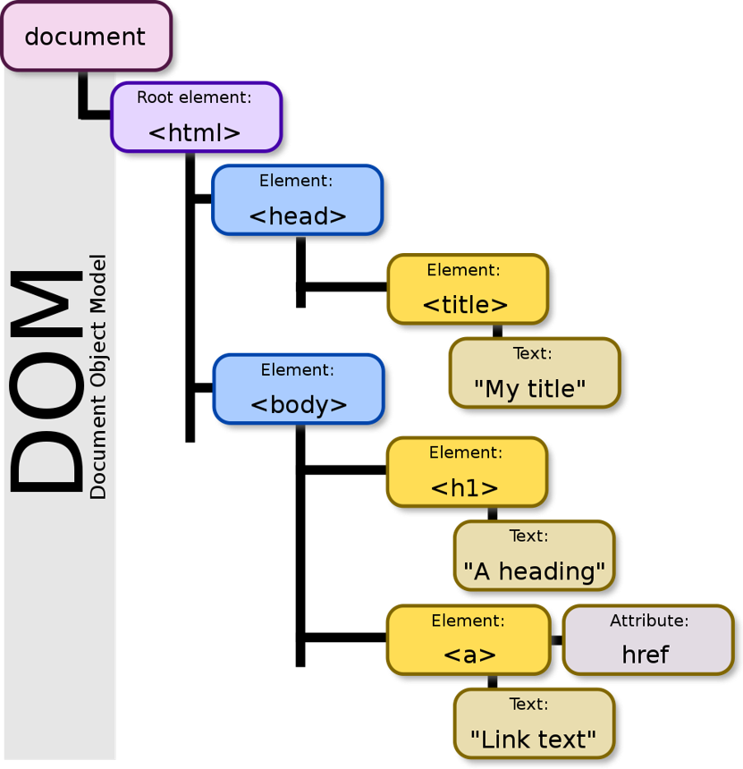

CSS -> 幫自己的 HTML 元素**新增樣式**的方法，有各種顏色、排版更符合美感

# DOM Tree

DOM Tree (文件物件模型 Document(HTML) Object(OOP) Model ) 是加載到瀏覽器中網頁的**樹狀表示**

在 DOM Tree 中，父節點 Parent Node 可被稱為 Child Node 的父元素 Parent Element 反之， Child Node 可稱為 Parent Node 的子元素 Child Element

瀏覽器加載網頁時，它會創建該頁面的 DOM Tree



# CSS 3

CSS (階層式樣式表 Cascading Style Sheet)被用來設定網頁的樣式及佈局

Ex:改變字體、顏色、尺寸以及擺放的內容、拆分為多欄，或是添加動畫效果和其它裝飾的特性

_注意！！我們沒有必要了解所有世界上存在的 CSS 屬性! 只要認識常用的以及實用的屬性即可_

[CSS mdn](https://developer.mozilla.org/en-US/docs/Web/CSS)

[CSS reference](https://developer.mozilla.org/en-US/docs/Web/CSS/Reference)

CSS comment 語法為 `/**/`

`練習`

最簡單的 CSS 寫法

```CSS
<head>
    <style>
      /* selector */
      h1 {
        color: red;
      }

      h2 {
        color: green;
      }
    </style>
</head>
```

# 樣式附加於 HTML

CSS 程式碼基本上可放置於三個地方：

- inline styling (把 HTML 寫在同一行) 優點是*優先層級最高*，但缺點是只能對**特定**的標籤設定樣

```CSS
<h1 style="color: red;">國立故宮博物院</h1>
```

- internal styling (把 HTML 文件跟 CSS 文件放在同一個文件當中，修改的內容僅限於當前文件) 優點是方便撰寫，缺點是若有多個 HTML 頁面，則難以維護程式碼

```CSS
<head>
    <style>
      /* selector */
      h1 {
        color: red;
      }

      h2 {
        color: green;
      }
    </style>
</head>
```

- external styling (CSS 寫一份文件，HTML 寫一份文件，讓 HTML 去連結到 CSS 頁面) 最常見的放置位置，其優點為容易維護

HTML 的 head 連結 CSS 文件

```HTML
<head>
<link rel="stylesheet" href="./style.css" />
</head>
```

CSS 文件內容

```CSS
selector
h1 {
  color: red;
}

h2 {
  color: green;
}
```

# 顏色設定

CSS 當中有下列幾種常見的顏色設定方式：

- Color Keywords (named color) ：這些為 CSS**預定保留**的關鍵字，例如 red, black, purple, green, 珊瑚色 coral 等等

[ndn named-color](https://developer.mozilla.org/en-US/docs/Web/CSS/named-color)

- rgb：依照光學三原色，分別設定**紅、綠、藍**三個色彩  
  數值範圍是 0 到 255，共 256 (2^8) 種不同選擇

  每個 color channel 使用 1 byte (=8bits)來儲存

  ```CSS
  h1 {
  color: rgb(255, 255, 0);
  }
  ```

- rgba：同 rgb，但使用多一個叫**alpha**的 channel 來儲存*透明度*  
  透明度範圍是 0 到 1

  ```CSS
  h1 {
  color: rgba(255, 255, 0, 0);
  }
  ```

- hex：使用**十六進制**的數字來代表顏色  
  十六進制數字的範圍是 0, 1, 2, …, 8, 9, A, B, C, …, F

  ```CSS
  h1 {
  color: #000000;
  }
  ```

- HSL：即色相、飽和度、亮度（Hue, Saturation, Lightness）  
  這種表示法試圖做到比基於笛卡爾坐標系的幾何結構 RGB 更加直觀

  ```CSS
  h1 {
  color: #cec2e0;
  }
  ```

HSL 與 hex 系統互換可由用 [系統互換](https://coloors86.netlify.app) 完成

# CSS Selectors 選擇器

選擇器 Selectors -> CSS 中去選擇哪些 HTML 的標籤是我們要選擇來套用樣式的

- 全部的選擇器 Universal Selector `*` 匹配*任何類型*的 HTML element

  ```CSS
  *{
  color: blue;
  }
  ```

- Element Selector 可選擇特定的 HTML element (tag)

  ```CSS
  h2 {
  color: green;
  }
  ```

- ID Selector 可選擇有特定 ID 屬性的 HTML element

  ID 只能設定特定標籤，**不可重複利用**

  Defines a **unique** identifier (ID) which must be unique in the whole document

  [mdn id](https://developer.mozilla.org/zh-CN/docs/Web/HTML/Global_attributes/id)

  ```CSS
  #first-paragraph {
  color: rgb(128, 64, 0);
  }
  ```

- Class Selector 可選擇所有有特定 class 屬性的 HTML element

  **class 可以重複利用，設定在不同標籤中**

  A space-separated list of the classes of the element

  ```CSS
  .blue-text {
  color: purple;
  }
  ```

  一個標籤可以有多個 class，在後面加空白鍵

  HTML 文件內容，同時給顏色、放大字體效果

  ```HTML
  <p class="blue-text large-text">
  ```

  CSS 文件內容，設定方式

  ```CSS
  .blue-text {
  color: purple;
  }

  .large-text{
    font-size: 32px; /*文字大小*/
  }
  ```

`element selector、class selector並用`

```CSS
a.large-text{  /* 選取<a> + . + class name */
  font-size: 32px;
}
```

- Grouping Selector 可**一次選擇數個** HTML 元素，並以*逗號*分隔

  ```CSS
  h1,
  h2,
  h3,
  h4,
  h5,
  h6{
    color: red;
  }
  ```

- 後裔 Descendant Selector 由兩個或多個用**空格分隔**的選擇器組成

  HTML 文件

  ```HTML
  <h2>相關頁面</h2>
  <div class="link1">
    <a href="https:www.google.com">Google首頁</a>
    <a href="https:www.youtube.com">YouTube首頁</a>
  </div>
  <div class="link2">
    <a href="https:www.yahoo.com">yahoo首頁</a>
  </div>
  ```

  CSS 文件

  ```CSS
  div.link1 a {
    color: red;
  }

  div.link2 a {
    color: green;
  }
  ```

- Attribute Selector 選擇**所有**具有**相同屬性**的 HTML 元素

  ```CSS
  input[type="text"] {
    color: red;
  }
  ```

- pseudo-class 用於指定所選**元素**的**特殊狀態**

class 單字的使用更多是指**具有共同特徵並通過種類或質量與其他事物區分開來的一組或類別的事物**，跟 Object-Oriented Programming 當中的 class 無關

例如：  
`:hover` 可用於在用戶滑鼠懸停在按鈕上時更改按鈕的樣式

```CSS
input[type="text"] {
  color: red;
}

/* 當滑鼠游標碰到要輸入的文字時，會變色 */
input[type="text"]:hover {
  color: lightgreen;
}

/* 當滑鼠點要輸入的文字時，會變色 */
input[type="text"]:active {
  color: lightgreen;
}

/* 在當前輸入欄上，文字會變色 */
input[type="text"]:focus {
  color: lightgreen;
}
```

`:nth-child()`可用來選擇第**n**個元素

- 不存在的元素 pseudo-element 是添加到選擇器的關鍵字，可讓我們設置所選元素的**特定部分**的樣式

例如：

`::before`

```CSS
p::before {
  content: ">>";
  color: blue;
}
```

目的在於創造一個 DOM 當中不存在的 HTML 元素。我們知道第一行並沒有被任何 tag 包住，但::first-line 選取的過程中，就像是用了一個看不到的 tag 把第一行包住，所以才能選到這行。

`::first-line` 可用於更改段落第一行的字體

```CSS
p::first-line {
  font-size: 32px;
}
```

`::selection` 更改選取時的底色

```CSS
*::selection {
  background-color: lightgreen;
}
```

# CSS 概念

## 繼承 Inheritance

### Parents and Children

在 HTML 當中的 DOM Tree 中，Parent Node 可被稱為 Child Node 的父元素 Parent Element，反之， Child Node 可稱為 Parent Node 的子元素 Child Element

### Inherited Properties and Non-Inherited Properties

CSS 當中的某些屬性會被子元素繼承，而某些不會

會繼承的屬性中，常見的包含 `color`, `font-family`, `font-size`, `font-weight`, `list-style-type`, `text-align`

[詳細清單](https://www.w3.org/TR/CSS21/propidx.html)

然而，因為 user agent styling 優先度比 inheritance 更高，所以要注意瀏覽器的預設樣式**可能會覆蓋**繼承的屬性。例如，`<a>`標籤的顏色通常需要額外設定

user agent styling -> 指 brower default ，瀏覽器給的預設樣式
