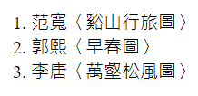
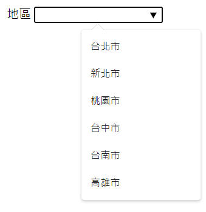

# 介紹

HTML 不是程式語言，是標記語言  
製作網頁的三大基石**➜**HTML(網頁內容)、CSS(網頁外觀)、JS(功能性)

## HTML 標籤包含四元素

- Opening tag 起始標籤

  包含元素的名字，夾在一對< >brackets 之間

- Closing tag 結束標籤

  夾在一對</ >brackets 之間，多”/”foward slash

- Content 內容
- Element 元素

  標籤是 HTML Element


## 巢狀元素 Nesting elements

把元素放到另一個元素  
必須要有正確的<> </>去完成，沒使用正確語法，容易導致無法解讀

## 重要的元素類別

要能夠自行判斷，之後使用 CSS 時要能預想這個元素會不會產生新的一行，會的話要考慮如何移動，才能做排版

### block elements

頁面中組成一個可見區塊，並在頁面中單獨佔據一行，在它前後的內容都將以一個換行分隔

ex.段落&lt;p&gt;、列表&lt;ol&gt; &lt;ul&gt;、導航選單 navigation menus、頁尾 footers、&lt;body&gt;

不會巢套在 inline elements 中，但有可能會巢套其他 block elements 中，ex.&lt;strong&gt;、&lt;div&gt;(division 區塊)

```HTML
// HTML
<p>
  <strong></strong>
  <div></div>
</p>
```

### inline elements 同一行

放在 block elements 之中的內容，這些元素只由文件內容的一小部分組成，而非由完整段落或群組式內容組成

會一直併排到空間不夠，才會換行

ex.&lt;a&gt;、&lt;span&gt;

## W3C 提供的 HTML Validator(驗證器)可以確認正確性

[Validator](https://validator.w3.org/#validate_by_uri)

- URL **➜**用網址驗證
- File Upload **➜**上傳檔案
- Direct input **➜**直接貼程式碼

## 物件導向 Object-Oriented (OOP) <u>ex.C,C++,Java,JS,Python</u>

生活中物件包含兩部分

- 屬性 Attributes/Property <u>ex.廠牌、出廠年份</u>
- 行為 Methods/Function/Behavior <u>ex.直走、左轉</u>

## 骨架 Skeleton

建構每個 HTML 網頁所需的一組標籤，告訴瀏覽器他正在讀取甚麼樣類型的文件

- `<head>`
- `<body>`

```HTML
// HTML
<!DOCTYPE html> #document_type文件類型
<html>
  <head></head>
  <body></body>
</html>
```

# Tag

## opening tag &closing tag

&lt;p&gt;、&lt;a&gt;

## self-closing tag

&lt;img /&gt;、&lt;base /&gt;、&lt;meta /&gt;

# 路徑

## absolite linking/path 絕對路徑

需要連結到不在我們伺服器內的資源時，使用完整的**URL**當作連結對象

如果網頁被刪除就會抓取不到

```HTML
// HTML
<a href="https://www.npm.gov.tw/">anchor_tag_absolite_linking</a>
```

## relative linking/path 相對路徑

連結到相對於目前文件所在位置的檔案，上傳到網站上就會比較占空間

**.** 目前 html 文件所在資料夾位置

**..** 上層的資料夾位置

**/** 可從 root directory (最上層的資料夾) 向下連結

<font color=red>**文件與檔案名稱不建議中間留空白鍵**</font>

```HTML
// HTML
<a href="./fitst.html">anchor_tag_relative_inking</a>
```

# &lt;head&gt;

**➜**包含網頁的特定信息，跟網頁有關的訊息 ex.誰寫的、語言、樣式(給搜尋引擎看)

**➜**通常是 meta data(我自己)

**➜**<u>title 文檔標題(強制性)、script、script linking、CSS</u>

## 總整理

[總整理](https://htmlhead.dev/)

Recommended Minimum 推薦的少一定要放的東西

```HTML
// HTML
<meta charset="utf-8">
<meta name="viewport" content="width=device-width, initial-scale=1">
<!--
  The above 2 meta tags *must* come first in the <head>
  to consistently ensure proper document rendering.
  Any other head element should come *after* these tags.
 -->
<title>Page Title</title>
```

## lang 屬性**➜**設定網頁語言

lang="en”➜ 英文網頁

[語言設定寫法](https://www.w3schools.com/tags/ref_language_codes.asp)

## meta charset="UTF-8" 字集

會放在 head 標籤內容中的最上面

charset**➜** character set 字元集合

body 裡面顯示的內容符合 UTF-8 字集

```HTML
// HTML
<meta charset="UTF-8" />
```

## 視窗設定

meta name="viewport(視窗)"

意思 : 我要設定我 viewport(視窗)的範圍，他的 width(寬度)是 device-width(我裝置的寬度)initial-scale(最初始的放大程度)1.0**➜**沒有任何放大的值

```HTML
// HTML
<meta name="viewport" content="width=device-width, initial-scale=1.0" />
```

## 網頁底下的描述

```HTML
// HTML
<meta name="description" content="A description of the page">
```


## 讓搜尋引擎找到我們的網頁

```HTML
// HTML
<meta name="robots" content="index,follow"><!-- All Search Engines -->
<meta name="googlebot" content="index,follow"><!-- Google Specific -->
```

## 顯示作者

```HTML
// HTML
<meta name="author" content="人名">
```

## 標記語法

快捷:Crtl+/(?鍵)

```HTML
// HTML
<!--文字-->
```

## &lt;a&gt; 全體屬性設定

一次設定所有&lt;a&gt;的屬性

```HTML
// HTML
<base target="   " />
```

# &lt;body&gt;

**➜**使用者可見的內容

**➜**定義文檔的正文 ex.內容、圖像、超連結、表格、列表

## H1~H6

HTML 標籤是定義整個**網頁的架構**，並非樣式(CSS 的工作)

應該把**最重要**的資料放進**H1**

正確使用可以做到 SEO(Search Engine Optimization)<u>搜尋引擎的最佳化</u>

## &lt;P&gt;

定義一個段，每個&lt;P&gt;元素前後會有空行

## &lt;a&gt; anchor tag

a+`tab`

網頁上創建超連結

提供 absolute linking 或 relative linking 作為其“href” (hyptertext reference)值

```HTML
// HTML
<a href="https://www.npm.gov.tw/">故宮網站連結</a>
```

### target 屬性

[屬性種類參考](https://developer.mozilla.org/en-US/docs/Web/HTML/Element/a)

`_self` 原視窗開啟 The current browsing context.

`_blank` 開啟新視窗 Usually a new tab, but users can configure browsers to open a new window instead.

```HTML
// HTML
<a href="https://www.npm.gov.tw/" target="_self">故宮網站連結</a>
```

如果 &lt;a&gt; 比較多，可以在 &lt;head&gt; 使用 &lt;base&gt; 定義所有標籤屬性

```HTML
// HTML
<base target="_blank" />
```

## &lt;img&gt;

有兩個屬性要設定

1.src (source) 圖片來源

2.alt (alternative) 圖片無法顯示時的**替代**文字

### relative linking

```HTML
// HTML

```

### absolite linking

```HTML
// HTML

```

## list 列表

### &lt;ul&gt; unordered list 沒順序的列表

會以**點**的方式呈現


```HTML
// HTML

<ul>
  <li>北部院區</li>
  <li>南部院區</li>
</ul>
```

#### ul 屬性更改

[ul 屬性更改](https://developer.mozilla.org/en-US/docs/Web/HTML/Element/ul)

type:

- circle
- disc
- square
  Warning: Do not use this attribute, as it has been deprecated; use the **CSS** list-style-type property instead.

### &lt;ol&gt; ordered list 有順序的列表

會有 1. 2. 3. 的方式呈現



```HTML
// HTML
<ol>
  <li>范寬〈谿山行旅圖〉</li>
  <li>郭熙〈早春圖〉</li>
  <li>李唐〈萬壑松風圖〉</li>
</ol>
```

#### ol 屬性更改

[ol 屬性更改](https://developer.mozilla.org/en-US/docs/Web/HTML/Element/ol)

type:

- 'a' for lowercase letters
- 'A' for uppercase letters
- 'i' for lowercase Roman numerals
- 'I' for uppercase Roman numerals
- '1' for numbers (default) 預設

## 表格製作

- &lt;table&gt; -> 定義整個表格
- &lt;tr&gt; -> table row，建構每一行
- &lt;th&gt; -> table heading，定義 HTML 表格中的標題單元格
- &lt;td&gt; -> table data，定義實際數據

選擇性使用(比較能使網頁看懂，可明確區分標題跟主體)

- &lt;thead&gt; -> table head
- &lt;tbody&gt; -> table body
- &lt;tfoot&gt; -> table foot 最底層的部分

```HTML
// HTML
<head>
  <style>
    table,
    tr,
    th,
    td {
      border: 1px solid black;
      border-collapse: collapse;
    }
  </style>
</head>

<body>
  <h2>基礎資訊</h2>
  <table>
    <tr>
      <th colspan="3">國立故宮博物院資訊</th>
    </tr>
    <tr>
      <th>所屬部門</th>
      <th>員額</th>
      <th>授權法源</th>
    </tr>
    <tr>
      <td>行政院</td>
      <td>502人</td>
      <td>《行政院組織法》、《國立故宮博物院組織法》</td>
    </tr>
  </table>
</body>
```


### 表格屬性

- colspan (column span) 屬性定義表格單元格應跨越的**列數**
- rowspan 定義表格單元格應跨越的**行數**

## 表單製作

前端的 HTML 表單內資料通常會被傳送到後端伺服器，而伺服器把收到的資料存放到資料庫後，再回傳一個回應給客戶端

&lt;input&gt; -> 使用者填入資料

&lt;label&gt; -> 標題或內容

```HTML
// HTML
<label for="">姓名:</label>
```

&lt;input type="text" /&gt; -> 屬性設定為文字

```HTML
// HTML
<input type="text" />
```

自動聚焦 lable for=" " + input id=" " ->這樣點標題時，會自動聚焦在要填寫的格子上

```HTML
// HTML
<label for="名字">姓名:</label>
<input id="名字" type="text" />
```

### button

button type="submit" -> 按下 button 後，檔案會傳送到後端

若放在&lt;form&gt;標籤內，則預設的 type 是 submit

[button tag](https://developer.mozilla.org/en-US/docs/Web/HTML/Element/button)

- submit 資料會被叫到後端去 The button submits the form data to the server.
- reset 所有值會被重新設定 The button resets all the controls to their initial values.
- button 單純 button 沒有動作 The button has no default behavior, and does nothing when pressed by default.

```HTML
// HTML
<button type="submit">文字</button>
```

### type 屬性

[input type](https://developer.mozilla.org/en-US/docs/Web/HTML/Element/input)

<table align="center">
  <thead>
    <tr>
      <th>type</th>
      <th>說明</th>
      <th>補充</th>
    </tr>
  </thead>
  <tbody>
    <tr>
      <td>password</td>
      <td>輸入字元時不會顯示內容</td>
      <td>
      <ul>
        <li>minlength 限制最短長度</li>
        <li>maxlength 限制最長長度</li>
      </td>
    </tr>
    <tr>
      <td>text</td>
      <td>輸入文字</td>
      <td>
        <ul>
        <li>required 要求使用者一定要填這格</li>
        <li>placeholder 提醒輸入值</li>
        </ul>
      </td>
    </tr>
    <tr>
      <td>checkbox</td>
      <td>點選打勾的方塊</td>
      <td>
        <ul>
          <li>checked 預設已打勾</li>
          <li>value 定義checkbox 回傳出的值</li>
        </ul>
      </td>
    </tr>
    <tr>
      <td>email</td>
      <td>只能填寫信箱</td>
      <td> 
        <ul>
          <li>required 要求使用者一定要填這格</li>
        </ul>
      </td>
    </tr>
    <tr>
      <td>file</td>
      <td>可以選取文件</td>
      <td> </td>
    </tr>
    <tr>
      <td>number</td>
      <td>只能填數字</td>
      <td>
        <ul>
          <li><a href="https://developer.mozilla.org/en-US/docs/Web/HTML/Element/input/number">input number</a></li>
          <li>value 預設值</li>
          <li>min 設定最小值</li>
          <li>max 設定最大值</li>
          <li>step 數字移動的跳動點</li>
        </ul>
      </td>
    </tr>
    <tr>
      <td>radio</td>
      <td>在集合的組合中，只能選擇一個值</td>
      <td>
      <li><a href="https://developer.mozilla.org/en-US/docs/Web/HTML/Element/input/radio">input radio</a></li>
      <li>name 屬性名稱一樣，就會只回傳一個值回去</li>
      <li>required 要求使用者一定要填這格，可以只，可以只放一個選項後面</li>
      </td>
    </tr>
    <tr>
      <td>range</td>
      <td>可拖曳的滑桿</td>
      <td> </td>
    </tr>
  </tbody>
</table>

### select/option

下拉式選單

```HTML
// HTML
<label for="gender">性別:</label>
<select name="gender" id="gender" required>
  <option></option>
  <option value="male">男性</option>
  <option value="female">女性</option>
  <option value="other">其他</option>
</select>
```

### data list

秀出可選清單

```HTML
// HTML
<label for="area">地區</label>
<input list="area-list" type="text" name="area" id="area" />
<datalist id="area-list">
  <option value="台北市">台北市</option>
  <option value="新北市">新北市</option>
  <option value="桃園市">桃園市</option>
  <option value="台中市">台中市</option>
  <option value="台南市">台南市</option>
  <option value="高雄市">高雄市</option>
</datalist>
```



### textarea

可以填寫長篇大論的東西(詳述)

```HTML
// HTML
<label for="suggestion">給網站的建議:</label>
<textarea
  name="suggestion"
  id="suggestion"
  cols="30"
  rows="10"
  placeholder="填寫給網站的建議"
></textarea>
```

### 補充說明

&lt;form&gt;

- action 屬性定義了在 HTML 文檔中提交表單時將表單數據發**送到何處**

- **name** 屬性的資料才會被送到後端伺服器

- method 屬性告訴瀏覽器如何將表單數據發**送到服務器**

  - GET -> data 會被附加到 action 指定的 URL，並且用**?**分隔數據
    向伺服器請求公開透明資料

  - POST -> 會把資料隱藏起來，或用來向伺服器寄送需要被儲存或處理的資料

- index.html 是伺服器在目錄中查找的默認文件

- self-closing tag 和所有其他標籤之間的重要區別是**自閉合標籤代表 空白元素** void element，不能包含任何 content

- Favicon 是 favorites icon 的縮寫，瀏覽器可以將 favicon 顯示於瀏覽器的網址列中，也可置於書籤列表的網站名稱前  
  icon 的檔案名稱會設定為 favicon.ico
  ```HTML
  // HTML
  <link rel="icon" href="檔案位置" />
  ```

#### &lt;br&gt;

插入一個換行符，想要換行但不想要開始一個新的標籤的時候，或同個標籤內部會需要換行

#### &lt;hr&gt; horizontal rule

段落之間的主題中斷，如下圖分隔線


#### 添加特殊符號

要將符號添加到 HTML 頁面，我們可以使用 HTML entity

HTML entity 使用與號 & 開頭並以分號 ; 結尾

[HTML symbols](https://www.htmlsymbols.xyz/)
